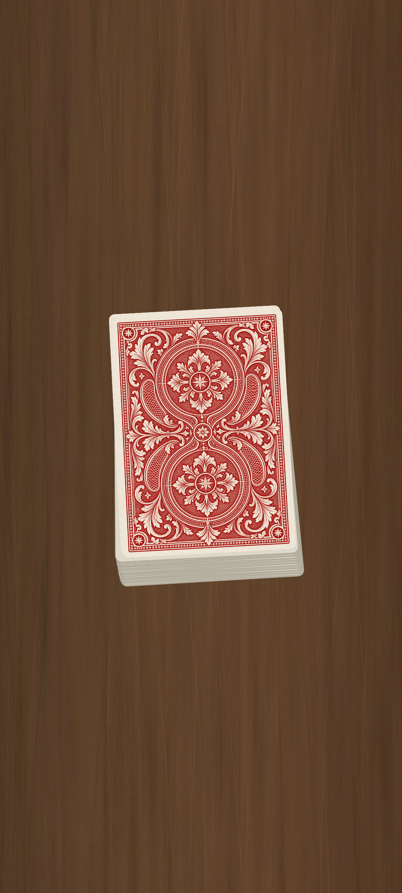

# berglas — Android Magic App

**A wooden table. A deck of cards. A stage for your performance.**

[简体中文](README.md) · [Development](docs/DEVELOPMENT.md) · [Contributing](CONTRIBUTING.md)

berglas is an offline card-magic performance tool for Android, built with Kotlin and Jetpack Compose. Classic red and blue cards, a wooden tabletop, and natural card interactions create a minimal, immersive setting.

This independent project is unaffiliated with any person, brand, or organization sharing its name.

## Features

- Offline operation: no account, server, or internet permission.
- 52 individually movable cards, free placement, and automatic layering.
- Single-finger double-tap to reveal; both face-down and revealed cards remain draggable.
- Red and blue decks, layered tuck-box artwork, paper edges, and soft shadows.
- A downward sleeve animation over a consistent wooden background.
- Separated state and UI code, with unit and device tests.

## Download and install

Download a publisher-provided APK from this repository's **Releases** page and open it on an Android phone. Requires **Android 8.0 (API 26)** or later. APKs marked debug are intended for testing.

If no release is available, follow the [development guide](docs/DEVELOPMENT.md). The initial build downloads development dependencies; the installed app works offline.

## Basic interactions

1. Launch the app and swipe downward from the center of the tuck box.
2. Drag an accessible card and release it to leave it in place.
3. Tap the same card twice with one finger to reveal it.
4. Double-tap an empty area to spread the deck and retrieve off-screen cards.

Public documentation covers visible interactions and development without explaining the performance method. Full source is included; open source does not keep implementation details confidential.

## Development and contributions

Stack: Kotlin, Jetpack Compose, Android SDK 35, and JDK 17.
Contributions to performance, gestures, artwork, accessibility, and device compatibility are welcome.

- [Build and development](docs/DEVELOPMENT.md)
- [Testing checklist](docs/TESTING.md)
- [Asset notes](docs/ASSETS.md)
- [Contribution guide](CONTRIBUTING.md)

Current source version: **2.2.1**. The repository is presented as berglas. The existing application ID, some artwork, and APK filenames retain Atelier naming for compatibility.

## License

Project-owned code uses the [MIT License](LICENSE). Third-party artwork and the Gradle Wrapper retain their respective licenses; see [asset notes](docs/ASSETS.md).

## Contact and collaboration

Interested in magic software development or collaboration? Add me on WeChat (vx): **w2790382370**.
